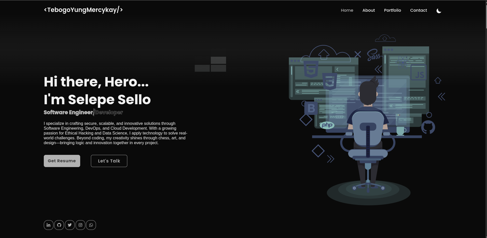

# Portfolio Website



Welcome to my personal portfolio website repository. This project showcases my skills, projects, and professional experience as a developer.

## Table of Contents

- [Portfolio Website](#portfolio-website)
  - [Table of Contents](#table-of-contents)
  - [Overview](#overview)
  - [Tech Stack](#tech-stack)
  - [Project Structure](#project-structure)
  - [License](#license)
  - [Credits](#credits)
  - [Contact](#contact)

## Overview

This website highlights my background, technical skills, and selected projects. Explore the site to learn more about my work and expertise.

## Tech Stack

- JavaScript
- HTML & CSS
- Bootstrap
- jQuery
- JSON

## Project Structure

```
.
├── CODE_OF_CONDUCT.md
├── css/
├── images/
├── js/
├── json/
├── LICENCE.md
├── index.html
├── README.md
└── README.pdf
```

- **css/**: Stylesheets for different sections and themes
- **images/**: Portfolio and project images
- **js/**: JavaScript files for interactivity and data handling
- **json/**: Data files for dynamic content

## License

This project is licensed under the Apache License. See the [LICENSE](LICENCE.md) file for more details.

## Credits

<div align="center">
  <a href="https://www.youtube.com/watch?v=sQoiM7i5Nqc" target="_blank">
    
  </a>
</div>

> Starter Code Credits: <a href="https://codehalweb.com/responsive-portfolio-website/" target="_blank">https://codehalweb.com/responsive-portfolio-website/</a>

## Contact

- WhatsApp/Mobile: +27 66 411 0178
- Email: [sbkskhalo.kq@gmail.com](mailto:sbkskhalo.kq@gmail.com)
- LinkedIn: [sello-selepe-tebogoyungmercykay](https://www.linkedin.com/in/sello-selepe-tebogoyungmercykay)
- GitHub Profile: [Profile Link](https://github.com/TebogoYungMercykay)

Feel free to reach out for collaboration, networking, or questions. My contact details and professional profiles are listed above. Thank you for visiting my portfolio.

---
