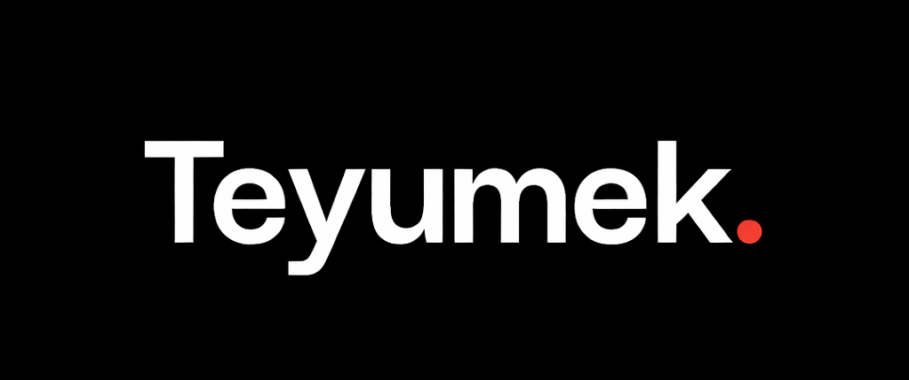

# Portfolio Website



Welcome to my personal portfolio website repository. This project showcases my skills, projects, and professional experience as a developer.

## Overview

This website highlights my background, technical skills, and selected projects. You can explore the site to learn more about my work and expertise.

## Tech Stack

- **Framework:** Next.js (React)
- **Language:** TypeScript
- **Styling:** Tailwind CSS, Custom CSS
- **Fonts:** Poppins, Montserrat (self-hosted)
- **Icons:** Boxicons, Bootstrap Icons
- **Deployment:** Vercel, Docker

## Features

- Dark/Light theme toggle with persistent preference
- Responsive design with mobile navigation menu
- Interactive languages carousel showcasing GitHub stats
- Skill proficiency progress bars
- Project portfolio grid with live demo and GitHub links
- Contact form with validation (powered by SheetDB)
- Animated background grid effect
- Dynamic viewport ratio scaling for consistent sizing across breakpoints
- **SEO Optimized** with meta tags, JSON-LD structured data, sitemap, and robots.txt

## SEO Configuration

This portfolio website includes comprehensive SEO optimizations:

- **Metadata Configuration** (`src/lib/seo.ts`): Centralized site metadata including title, description, keywords, author info, and Open Graph tags
- **JSON-LD Structured Data** (`src/components/JsonLd.tsx`): Schema.org markup for better search engine understanding
- **Dynamic Sitemap** (`src/app/sitemap.ts`): Auto-generated XML sitemap for search engine crawlers
- **Robots.txt** (`src/app/robots.ts`): Crawler directives and sitemap reference
- **Responsive Meta Tags**: Viewport configuration and mobile optimization
- **Social Media Cards**: Open Graph and Twitter Card support for rich link previews

## Project Structure

```text
.
├── Dockerfile                  # Container build configuration
├── next.config.mjs             # Next.js configuration
├── tailwind.config.ts          # Tailwind CSS theme and extensions
├── tsconfig.json               # TypeScript compiler options
├── postcss.config.mjs          # PostCSS plugins
├── package.json                # Dependencies and scripts
├── CODE_OF_CONDUCT.md          # Contribution guidelines
├── LICENCE.md                  # Apache License
├── code.md                     # Additional documentation
└── src/
    ├── app/
    │   ├── globals.css         # Global styles, fonts, CSS variables, animations
    │   ├── layout.tsx          # Root layout with metadata and icon imports
    │   ├── page.tsx            # Main page composing all sections
    │   ├── sitemap.ts          # Dynamic sitemap generation
    │   └── robots.ts           # Robots.txt configuration
    │
    ├── components/
    │   ├── common/
    │   │   ├── LinkButton.tsx  # Reusable styled CTA button
    │   │   └── SocialLinks.tsx # Social media icon links
    │   ├── layout/
    │   │   ├── Header.tsx      # Sticky header with nav and mobile menu
    │   │   └── Footer.tsx      # Footer with copyright and scroll-to-top
    │   ├── site/
    │   │   ├── HomeSection.tsx      # Hero section orchestrator
    │   │   ├── AboutSection.tsx     # Bio, education, and experience orchestrator
    │   │   ├── PortfolioSection.tsx # Skills, carousel, and projects orchestrator
    │   │   ├── ContactSection.tsx   # Contact form and info orchestrator
    │   │   ├── ProjectCard.tsx      # Individual project card
    │   │   └── partials/
    │   │       ├── index.ts         # Barrel exports for partials
    │   │       ├── HeroContent.tsx      # Hero text, animated title, CTAs
    │   │       ├── ProfileImage.tsx     # Avatar with spinning border
    │   │       ├── JourneyTimeline.tsx  # Education + experience columns
    │   │       ├── JourneyCard.tsx      # Single timeline entry
    │   │       ├── SkillsSection.tsx    # Dual progress bar columns
    │   │       ├── ProjectsGrid.tsx     # Projects title and grid
    │   │       ├── ContactInfo.tsx      # Address, email, phone block
    │   │       └── ContactForm.tsx      # Form state, validation, submission
    │   ├── ui/
    │   │   ├── BackgroundAnimation.tsx  # Animated grid background
    │   │   ├── LanguagesCarousel.tsx    # Orbiting language icon carousel
    │   │   ├── ProgressBar.tsx          # Skill proficiency bar
    │   │   └── ThemeToggle.tsx          # Dark/light mode toggle
    │   └── JsonLd.tsx          # JSON-LD structured data component
    │
    ├── data/
    │   ├── index.ts            # Barrel exports
    │   ├── about-data.ts       # Education and experience entries
    │   ├── languages-data.ts   # Language stats, icons, and details
    │   ├── projects-data.ts    # Project portfolio entries
    │   └── social-media.ts     # Social media links
    │
    ├── lib/
    │   ├── helpers.ts          # Viewport ratio utility
    │   ├── seo.ts              # Site metadata and SEO configuration
    │   └── theme.ts            # Theme colors and toggle logic
    │
    └── types/
        └── index.ts            # TypeScript interfaces and types
```

## Getting Started

```bash
# Install dependencies
npm install

# Run development server
npm run dev

# Build for production
npm run build

# Start production server
npm start

# Or run with Docker
docker build -t portfolio.
docker run -p 3000:3000 portfolio
```

Open [http://localhost:3000](http://localhost:3000) to view the site locally.

## Releases

This site has evolved through multiple iterations. The current version is a complete rebuild in Next.js with TypeScript and Tailwind CSS, featuring comprehensive SEO optimization.

| Version                    | Stack                                    | Notable Features                                | Link                                                                                                     |
| -------------------------- | ---------------------------------------- | ----------------------------------------------- | -------------------------------------------------------------------------------------------------------- |
| **Next.js** (latest) | Next.js, TypeScript, Tailwind CSS        | SEO optimized with JSON-LD, sitemap, robots.txt | [v5.0.0]([https://github.com/TebogoYungMercykay/Portfolio_Website_Repository_Javascript/releases/tag/v5.0.0](https://github.com/TebogoYungMercykay/Portfolio_Website_Repository_Javascript/releases/tag/v5.0.0)) |
| **v4.0.3**           | HTML, CSS, JavaScript, jQuery, Bootstrap | Legacy jQuery implementation                    | [v4.0.3](https://github.com/TebogoYungMercykay/Portfolio_Website_Repository_Javascript/releases/tag/v4.0.3) |

View all previous releases: [All Releases](https://github.com/TebogoYungMercykay/Portfolio_Website_Repository_Javascript/releases)

## License

This project is licensed under the Apache License. Please take a look at the [LICENSE](LICENCE.md) file for more details.

> _Original design inspiration from [codehalweb.com](https://codehalweb.com/responsive-portfolio-website/). Rebuilt from scratch in Next.js with TypeScript and Tailwind CSS._

## Contact

- WhatsApp/Mobile: +27 66 411 0178
- Email: [sbkskhalo.kq@gmail.com](mailto:sbkskhalo.kq@gmail.com)
- LinkedIn: [in/sello-selepe-tebogoyungmercykay](https://www.linkedin.com/in/sello-selepe-tebogoyungmercykay)
- GitHub Profile: [Portfolio Website Link](https://tebogoyungmercykay.vercel.app)

Feel free to reach out for collaboration, networking, or questions. Thank you for visiting my portfolio.

---
